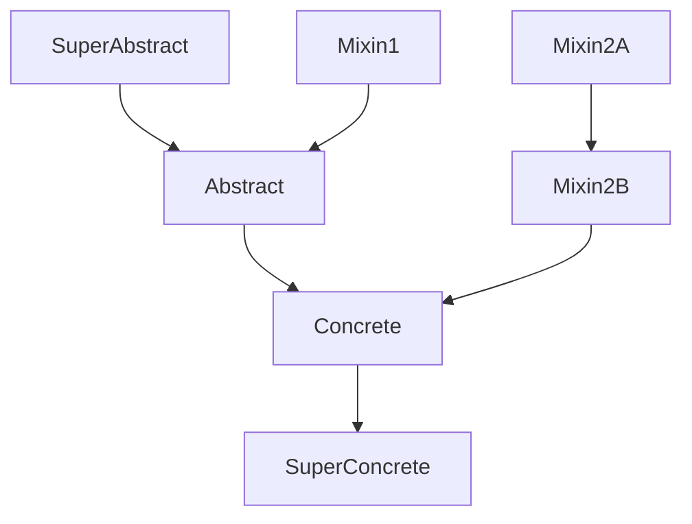

# General options

[](){#option-allow_inspection}
## `allow_inspection`

- **:octicons-package-24: Type [`bool`][] :material-equal: `True`{ title="default value" }**
<!-- - **:octicons-project-template-24: Template :material-null:** (contained in [`class.html`][class template]) -->

Whether to allow inspecting modules (importing them)
when it is not possible to visit them (parse their source code).

When loading data for a given package, [Griffe] discovers every Python module,
compiled or not, and inspects or visits them accordingly.

If you have compiled modules but also provide stubs for them,
you might want to disable the inspection of these modules,
because inspection picks up many more members,
and sometimes the collected data is inaccurate
(depending on the tool that was used to compile the module)
or too low-level/technical for API documentation.

See also [`force_inspection`](#force_inspection).

WARNING: **Packages are loaded only once.** When mkdocstrings-python collects data from a Python package (thanks to [Griffe](https://mkdocstrings.github.io/griffe/)), it collects *the entire package* and *caches it*. Next time an object from the same package is rendered, the package is retrieved from the cache and not collected again. The `allow_inspection` option will therefore only have an effect the first time a package is collected, and will do nothing for objects rendered afterwards.

```yaml title="in mkdocs.yml (global configuration)"
plugins:
- mkdocstrings:
    handlers:
      python:
        options:
          allow_inspection: true
```

```md title="or in docs/some_page.md (local configuration)"
::: path.to.object
    options:
      allow_inspection: false
```

/// admonition | Preview
    type: preview

//// tab | With inspection
<h2><code>SomeClass</code></h2>
<p>Docstring of the class.</p>
<h3><code>__eq__</code></h3>
<p>Method docstring.</p>
<h3><code>__weakref__</code></h3>
<p>Method docstring.</p>
<h3><code>documented_method</code></h3>
<p>Method docstring.</p>
////

//// tab | Without inspection
<h2><code>SomeClass</code></h2>
<p>Docstring of the class.</p>
<h3><code>documented_method</code></h3>
<p>Method docstring.</p>
////
///

[](){#option-backlinks}
## `backlinks`

[:octicons-heart-fill-24:{ .pulse } Sponsors only](../../insiders/index.md){ .insiders } &mdash;
[:octicons-tag-24: Insiders 1.10.0](../../insiders/changelog.md#1.10.0)

- **:octicons-package-24: Type <code><autoref identifier="typing.Literal" optional>Literal</autoref>["flat", "tree", False]</code> :material-equal: `False`{ title="default value" }**

The `backlinks` option enables rendering of backlinks within your API documentation.

When an arbitrary section of your documentation links to an API symbol, this link will be collected as a backlink, and rendered below your API symbol. In short, the API symbol will link back to the section that links to it. Such backlinks will help your users navigate the documentation, as they will immediately which functions return a specific symbol, or where a specific symbol is accepted as parameter, etc..

Each backlink is a list of breadcrumbs that represent the navigation, from the root page down to the given section.

The available styles for rendering backlinks are **`flat`** and **`tree`**.

- **`flat`** will render backlinks as a single-layer list. This can lead to repetition of breadcrumbs.
- **`tree`** will combine backlinks into a tree, to remove repetition of breadcrumbs.

WARNING: **Global-only option.** For now, the option only works when set globally in `mkdocs.yml`.

```yaml title="in mkdocs.yml (global configuration)"
plugins:
- mkdocstrings:
    handlers:
      python:
        options:
          backlinks: tree
```

/// admonition | Preview
    type: preview

//// tab | Flat

////

//// tab | Tree

////
///

[](){#option-extensions}
## `extensions`

- **:octicons-package-24: Type <code><autoref identifier="list" optional>list</autoref>[<autoref identifier="str" optional>str</autoref> | <autoref identifier="dict" optional>dict</autoref>[<autoref identifier="str" optional>str</autoref>, <autoref identifier="dict" optional>dict</autoref>[<autoref identifier="str" optional>str</autoref>, <autoref identifier="typing.Any" optional>Any</autoref>]]]</code> :material-equal: `[]`{ title="default value" }**
<!-- - **:octicons-project-template-24: Template :material-null:** (contained in [`class.html`][class template]) -->

The `extensions` option lets you enable [Griffe extensions](https://mkdocstrings.github.io/griffe/extensions/), which enhance or modify the data collected from Python sources (or compiled modules).

Elements in the list can be strings or dictionaries.

Strings denote the path to an extension module, like `griffe_typingdoc`, or to an extension class directly, like `griffe_typingdoc.TypingDocExtension`. When using a module path, all extensions within that module will be loaded and enabled. Strings can also be the path to a Python module, and a class name separated with `:`, like `scripts/griffe_extensions.py` or `scripts/griffe_extensions.py:MyExtension`.

Dictionaries have a single key, which is the module/class path (as a dot-separated qualifier or file path and colon-separated class name, like above), and its value is another dictionary specifying options that will be passed when to class constructors when instantiating extensions.

WARNING: **Packages are loaded only once.** When mkdocstrings-python collects data from a Python package (thanks to [Griffe](https://mkdocstrings.github.io/griffe/)), it collects *the entire package* and *caches it*. Next time an object from the same package is rendered, the package is retrieved from the cache and not collected again. Only the extensions specified the first time the package is loaded will be used. You cannot use a different set of extensions for specific objects rendered afterwards, and you cannot deactivate extensions for objects rendered afterwards either.

```yaml title="in mkdocs.yml (global configuration)"
plugins:
- mkdocstrings:
    handlers:
      python:
        options:
          extensions:
          - griffe_sphinx
          - griffe_pydantic: {schema: true}
          - scripts/exts.py:DynamicDocstrings:
              paths: [mypkg.mymod.myobj]
```

```md title="or in docs/some_page.md (local configuration)"
::: your_package.your_module.your_func
    options:
      extensions:
      - griffe_typingdoc
```

[](){#option-extra}
## `extra`

- **:octicons-package-24: Type [`dict`][] :material-equal: `{}`{ title="default value" }**
<!-- - **:octicons-project-template-24: Template :material-null:** (contained in [`class.html`][class template]) -->

The `extra` option lets you inject additional variables into the Jinja context used when rendering templates. You can then use this extra context in your [overridden templates][templates].

Local `extra` options will be merged into the global `extra` option:

```yaml title="in mkdocs.yml (global configuration)"
plugins:
- mkdocstrings:
    handlers:
      python:
        options:
          extra:
            hello: world
```

```md title="in docs/some_page.md (local configuration)"
::: your_package.your_module.your_func
    options:
      extra:
        foo: bar
```

...will inject both `hello` and `foo` into the Jinja context when rendering `your_package.your_module.your_func`.

> WARNING: Previously, extra options were supported directly under the `options` key.
>
> ```yaml
> plugins:
> - mkdocstrings:
>     handlers:
>       python:
>         options:
>           hello: world
> ```
>
> Now that we introduced optional validation of options and automatic JSON schema generation thanks to Pydantic, we require extra options to be put under `options.extra`. Extra options directly under `options` are still supported, but deprecated, and will emit deprecation warnings. Support will be removed in a future version of mkdocstrings-python.

[](){#option-find_stubs_package}
## `find_stubs_package`

- **:octicons-package-24: Type [`bool`][] :material-equal: `False`{ title="default value" }**
<!-- - **:octicons-project-template-24: Template :material-null:** (contained in [`class.html`][class template]) -->

When looking for documentation specified in [autodoc instructions][autodoc syntax] (`::: identifier`), also look for
the stubs package as defined in [PEP 561](https://peps.python.org/pep-0561/) if it exists. This is useful when
most of your documentation is separately provided by such a package and not inline in your main package.

WARNING: **Packages are loaded only once.** When mkdocstrings-python collects data from a Python package (thanks to [Griffe](https://mkdocstrings.github.io/griffe/)), it collects *the entire package* and *caches it*. Next time an object from the same package is rendered, the package is retrieved from the cache and not collected again. The `find_stubs_package` option will therefore only have an effect the first time a package is collected, and will do nothing for objects rendered afterwards.

```yaml title="in mkdocs.yml (global configuration)"
plugins:
- mkdocstrings:
    handlers:
      python:
        options:
          find_stubs_package: true
```

```md title="or in docs/some_page.md (local configuration)"
::: your_package.your_module.your_func
    options:
      find_stubs_package: true
```

```python title="your_package/your_module.py"

def your_func(a, b):
    # Function code
    ...

# rest of your code
```

```python title="your_package-stubs/your_module.pyi"

def your_func(a: int, b: str):
    """
    <Function docstring>
    """
    ...

# rest of your code
```

/// admonition | Preview
    type: preview

//// tab | With find_stubs_package
<h2><code>your_func</code></h2>
<p>Function docstring</p>
////

//// tab | Without find_stubs_package
<h2><code>your_func</code></h2>
////
///

[](){#option-force_inspection}
## `force_inspection`

- **:octicons-package-24: Type [`bool`][] :material-equal: `False`{ title="default value" }**
<!-- - **:octicons-project-template-24: Template :material-null:** (contained in [`class.html`][class template]) -->

Whether to force inspecting modules (importing them) even if their source code is available.

This option is useful when you know that dynamic analysis (inspection) yields better results than static analysis. Do not use this blindly: the recommended approach is to write a Griffe extension that will improve extracted API data. See [How to selectively inspect objects](https://mkdocstrings.github.io/griffe/guide/users/how-to/selectively-inspect/).

See also [`allow_inspection`](#allow_inspection).

```yaml title="in mkdocs.yml (global configuration)"
plugins:
- mkdocstrings:
    handlers:
      python:
        options:
          force_inspection: false
```

```md title="or in docs/some_page.md (local configuration)"
::: path.to.object
    options:
      force_inspection: true
```

WARNING: **Packages are loaded only once.** When mkdocstrings-python collects data from a Python package (thanks to [Griffe](https://mkdocstrings.github.io/griffe/)), it collects *the entire package* and *caches it*. Next time an object from the same package is rendered, the package is retrieved from the cache and not collected again. The `force_inspection` option will therefore only have an effect the first time a package is collected, and will do nothing for objects rendered afterwards.

[](){#option-preload_modules}
## `preload_modules`

- **:octicons-package-24: Type <code><autoref identifier="list" optional>list</autoref>[<autoref identifier="str" optional>str</autoref>] | None</code>  :material-equal: `None`{ title="default value" }**
<!-- - **:octicons-project-template-24: Template :material-null:** (N/A) -->

Pre-load modules that are not specified directly in [autodoc instructions][autodoc syntax] (`::: identifier`).
It is useful when you want to render documentation for a particular member of an object,
and this member is imported from another package than its parent.

For an imported member to be rendered,
you need to add it to the [`__all__`][__all__] attribute of the importing module.
The package from which the imported object originates must be accessible to the handler
(see [Finding modules](../index.md#finding-modules)).

```yaml title="in mkdocs.yml (global configuration)"
plugins:
- mkdocstrings:
    handlers:
      python:
        options:
          preload_modules:
          - their_package
```

```md title="or in docs/some_page.md (local configuration)"
::: your_package.your_module
    options:
      preload_modules:
      - their_package
```

```python title="your_package/your_module.py"
from their_package.their_module import their_object

__all__ = ["their_object"]

# rest of your code
```

/// admonition | Preview
    type: preview

//// tab | With preloaded modules
<h2><code>your_module</code></h2>
<p>Docstring of your module.</p>
<h3><code>their_object</code></h3>
<p>Docstring of their object.</p>
////

//// tab | Without preloaded modules
<h2><code>your_module</code></h2>
<p>Docstring of your module.</p>
////
///

[](){#option-show_bases}
## `show_bases`

- **:octicons-package-24: Type [`bool`][] :material-equal: `True`{ title="default value" }**
<!-- - **:octicons-project-template-24: Template :material-null:** (contained in [`class.html`][class template]) -->

Show the base classes of a class.

```yaml title="in mkdocs.yml (global configuration)"
plugins:
- mkdocstrings:
    handlers:
      python:
        options:
          show_bases: true
```

```md title="or in docs/some_page.md (local configuration)"
::: path.to.object
    options:
      show_bases: false
```

/// admonition | Preview
    type: preview

//// tab | With bases
<h2><code>SomeClass()</code></h2>
<p>Bases: <code><a href="#with">SomeBaseClass</a></code></p>
<p>Docstring of the class.</p>
////

//// tab | Without bases
<h2><code>SomeClass()</code></h2>
<p>Docstring of the class.</p>
////
///

[](){#option-show_inheritance_diagram}
## `show_inheritance_diagram`

[:octicons-heart-fill-24:{ .pulse } Sponsors only](../../insiders/index.md){ .insiders } &mdash;
[:octicons-tag-24: Insiders 1.7.0](../../insiders/changelog.md#1.7.0)

- **:octicons-package-24: Type [`bool`][] :material-equal: `False`{ title="default value" }**
<!-- - **:octicons-project-template-24: Template :material-null:** (contained in [`class.html`][class template]) -->

Show the inheritance diagram of a class using [Mermaid](https://mermaid.js.org/).

With this option enabled, an inheritance diagram (as a flowchart)
will be displayed after a class signature.
Each node will act as a cross-reference
and will bring you to the relevant class' documentation
when clicking on it.

It should work out of the box with [Material for MkDocs][].
For other themes, you must include Mermaid's Javascript code manually:

```yaml title="mkdocs.yml"
extra_javascript:
- https://unpkg.com/mermaid@10.9.0/dist/mermaid.min.js
```

```yaml title="in mkdocs.yml (global configuration)"
plugins:
- mkdocstrings:
    handlers:
      python:
        options:
          show_inheritance_diagram: true
```

```md title="or in docs/some_page.md (local configuration)"
::: path.to.object
    options:
      show_inheritance_diagram: false
```

/// admonition | Preview
    type: preview

With the following classes:

```python
class SuperAbstract:
    """Super abstract class."""
class Mixin1:
    """Mixin 1."""
class Abstract(SuperAbstract, Mixin1):
    """Abstract class."""
class Mixin2A:
    """Mixin 2A."""
class Mixin2B(Mixin2A):
    """Mixin 2B."""
class Concrete(Abstract, Mixin2B):
    """Concrete class."""
class SuperConcrete(Concrete):
    """Super concrete class."""
```

The diagram for `SuperConcrete` will look like this:



*Nodes are not clickable in this example
because these classes do not exist in our documentation.*
///

[](){#option-show_source}
## `show_source`

- **:octicons-package-24: Type [`bool`][] :material-equal: `True`{ title="default value" }**
<!-- - **:octicons-project-template-24: Template :material-null:** (contained in [`class.html`][class template] and  [`function.html`][function template]) -->

Show the source code of this object.

```yaml title="in mkdocs.yml (global configuration)"
plugins:
- mkdocstrings:
    handlers:
      python:
        options:
          show_source: true
```

```md title="or in docs/some_page.md (local configuration)"
::: path.to.object
    options:
      show_source: false
```

/// admonition | Preview
    type: preview

//// tab | With source
<h2><code>some_function()</code></h2>
<p>Docstring of the function.</p>

///// details | Source code in `package/module.py`
    type: quote

```python linenums="1"
def some_function():
    ...
```
/////
////

//// tab | Without source
<h2><code>some_function()</code></h2>
<p>Docstring of the function.</p>
////
///

[](){#option-skip_local_inventory}
## `skip_local_inventory`

- **:octicons-package-24: Type [`bool`][] :material-equal: `False`{ title="default value" }**
<!-- - **:octicons-project-template-24: Template :material-null:** (N/A) -->

Whether to skip registering symbols in the objects inventory.

With this option enabled, re-rendering docstrings for objects from external inventories is possible with their cross-references pointing to the original external inventory, not local. Similarly, it becomes possible to render the same symbol several times in the same documentation, with only one canonical location being used for cross-references (preventing confusion in mkdocs-autorefs).

```yaml title="in mkdocs.yml (global configuration)"
plugins:
- mkdocstrings:
    handlers:
      python:
        options:
          skip_local_inventory: false
```

```md title="or in docs/some_page.md (local configuration)"
::: path.to.module
    options:
      skip_local_inventory: true
```

/// admonition | Preview
    type: preview


//// tab | Without `skip_local_inventory`

```md exec="on"
::: bisect.bisect_left
    options:
      heading_level: 3
      skip_local_inventory: false
      show_docstring_description: false
```

Notice how [`bisect.bisect_left`][] now points to the section above.

////

//// tab | With `skip_local_inventory`

```md exec="on"
::: bisect.bisect_right
    inventories:
    - https://docs.python.org/3/objects.inv
    options:
      heading_level: 3
      skip_local_inventory: true
      show_docstring_description: false
```

Notice how [`bisect.bisect_right`][] points to the original Python documentation.

////
///
