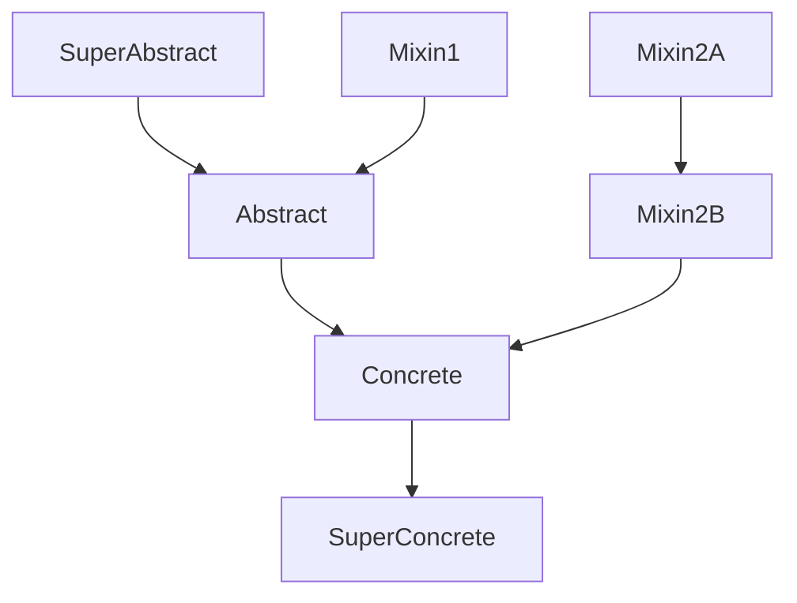

# General options

## `allow_inspection`

- **:octicons-package-24: Type [`bool`][] :material-equal: `True`{ title="default value" }**
<!-- - **:octicons-project-template-24: Template :material-null:** (contained in [`class.html`][class template]) -->

Whether to allow inspecting modules (importing them)
when it is not possible to visit them (parse their source code).

When loading data for a given package, [Griffe] discovers every Python module,
compiled or not, and inspects or visits them accordingly.

If you have compiled modules but also provide stubs for them,
you might want to disable the inspection of these modules,
because inspection picks up many more members,
and sometimes the collected data is inaccurate
(depending on the tool that was used to compile the module)
or too low-level/technical for API documentation.

```yaml title="in mkdocs.yml (global configuration)"
plugins:
- mkdocstrings:
    handlers:
      python:
        options:
          allow_inspection: true
```

```md title="or in docs/some_page.md (local configuration)"
::: path.to.object
    options:
      allow_inspection: false
```

/// admonition | Preview
    type: preview

//// tab | With inspection
<h2><code>SomeClass</code></h2>
<p>Docstring of the class.</p>
<h3><code>__eq__</code></h3>
<p>Method docstring.</p>
<h3><code>__weakref__</code></h3>
<p>Method docstring.</p>
<h3><code>documented_method</code></h3>
<p>Method docstring.</p>
////

//// tab | Without inspection
<h2><code>SomeClass</code></h2>
<p>Docstring of the class.</p>
<h3><code>documented_method</code></h3>
<p>Method docstring.</p>
////
///

## `show_bases`

- **:octicons-package-24: Type [`bool`][] :material-equal: `True`{ title="default value" }**
<!-- - **:octicons-project-template-24: Template :material-null:** (contained in [`class.html`][class template]) -->

Show the base classes of a class.

```yaml title="in mkdocs.yml (global configuration)"
plugins:
- mkdocstrings:
    handlers:
      python:
        options:
          show_bases: true
```

```md title="or in docs/some_page.md (local configuration)"
::: path.to.object
    options:
      show_bases: false
```

/// admonition | Preview
    type: preview

//// tab | With bases
<h2><code>SomeClass()</code></h2>
<p>Bases: <code><a href="#with">SomeBaseClass</a></code></p>
<p>Docstring of the class.</p>
////

//// tab | Without bases
<h2><code>SomeClass()</code></h2>
<p>Docstring of the class.</p>
////
///

## `show_inheritance_diagram`

[:octicons-heart-fill-24:{ .pulse } Sponsors only](../../insiders/index.md){ .insiders } &mdash;
[:octicons-tag-24: Insiders 1.7.0](../../insiders/changelog.md#1.7.0)

- **:octicons-package-24: Type [`bool`][] :material-equal: `False`{ title="default value" }**
<!-- - **:octicons-project-template-24: Template :material-null:** (contained in [`class.html`][class template]) -->

Show the inheritance diagram of a class using [Mermaid](https://mermaid.js.org/).

With this option enabled, an inheritance diagram (as a flowchart)
will be displayed after a class signature.
Each node will act as a cross-reference
and will bring you to the relevant class' documentation
when clicking on it.

It should work out of the box with [Material for MkDocs][].
For other themes, you must include Mermaid's Javascript code manually:

```yaml title="mkdocs.yml"
extra_javascript:
- https://unpkg.com/mermaid@10.9.0/dist/mermaid.min.js
```

```yaml title="in mkdocs.yml (global configuration)"
plugins:
- mkdocstrings:
    handlers:
      python:
        options:
          show_inheritance_diagram: true
```

```md title="or in docs/some_page.md (local configuration)"
::: path.to.object
    options:
      show_inheritance_diagram: false
```

/// admonition | Preview
    type: preview

With the following classes:

```python
class SuperAbstract:
    """Super abstract class."""
class Mixin1:
    """Mixin 1."""
class Abstract(SuperAbstract, Mixin1):
    """Abstract class."""
class Mixin2A:
    """Mixin 2A."""
class Mixin2B(Mixin2A):
    """Mixin 2B."""
class Concrete(Abstract, Mixin2B):
    """Concrete class."""
class SuperConcrete(Concrete):
    """Super concrete class."""
```

The diagram for `SuperConcrete` will look like this:



*Nodes are not clickable in this example
because these classes do not exist in our documentation.*
///

## `show_source`

- **:octicons-package-24: Type [`bool`][] :material-equal: `True`{ title="default value" }**
<!-- - **:octicons-project-template-24: Template :material-null:** (contained in [`class.html`][class template] and  [`function.html`][function template]) -->

Show the source code of this object.

```yaml title="in mkdocs.yml (global configuration)"
plugins:
- mkdocstrings:
    handlers:
      python:
        options:
          show_source: true
```

```md title="or in docs/some_page.md (local configuration)"
::: path.to.object
    options:
      show_source: false
```

/// admonition | Preview
    type: preview

//// tab | With source
<h2><code>some_function()</code></h2>
<p>Docstring of the function.</p>

///// details | Source code in `package/module.py`
    type: quote

```python linenums="1"
def some_function():
    ...
```
/////
////

//// tab | Without source
<h2><code>some_function()</code></h2>
<p>Docstring of the function.</p>
////
///

## `preload_modules`

- **:octicons-package-24: Type <code><autoref identifier="list" optional>list</autoref>[<autoref identifier="str" optional>str</autoref>] | None</code>  :material-equal: `None`{ title="default value" }**
<!-- - **:octicons-project-template-24: Template :material-null:** (N/A) -->

Pre-load modules that are not specified directly in [autodoc instructions][autodoc syntax] (`::: identifier`).
It is useful when you want to render documentation for a particular member of an object,
and this member is imported from another package than its parent.

For an imported member to be rendered,
you need to add it to the [`__all__`][__all__] attribute of the importing module.
The package from which the imported object originates must be accessible to the handler
(see [Finding modules](../index.md#finding-modules)).

```yaml title="in mkdocs.yml (global configuration)"
plugins:
- mkdocstrings:
    handlers:
      python:
        options:
          preload_modules:
          - their_package
```

```md title="or in docs/some_page.md (local configuration)"
::: your_package.your_module
    options:
      preload_modules:
      - their_package   
```

```python title="your_package/your_module.py"
from their_package.their_module import their_object

__all__ = ["their_object"]

# rest of your code
```

/// admonition | Preview
    type: preview

//// tab | With preloaded modules
<h2><code>your_module</code></h2>
<p>Docstring of your module.</p>
<h3><code>their_object</code></h3>
<p>Docstring of their object.</p>
////

//// tab | Without preloaded modules
<h2><code>your_module</code></h2>
<p>Docstring of your module.</p>
////
///

## `find_stubs_package`

- **:octicons-package-24: Type [`bool`][] :material-equal: `False`{ title="default value" }**
<!-- - **:octicons-project-template-24: Template :material-null:** (contained in [`class.html`][class template]) -->

When looking for documentation specified in [autodoc instructions][autodoc syntax] (`::: identifier`), also look for
the stubs package as defined in [PEP 561](https://peps.python.org/pep-0561/) if it exists. This is useful when
most of your documentation is separately provided by such a package and not inline in your main package.

```yaml title="in mkdocs.yml (global configuration)"
plugins:
- mkdocstrings:
    handlers:
      python:
        options:
          find_stubs_package: true
```

```md title="or in docs/some_page.md (local configuration)"
::: your_package.your_module.your_func
    options:
      find_stubs_package: true
```

```python title="your_package/your_module.py"

def your_func(a, b):
    # Function code
    ...

# rest of your code
```

```python title="your_package-stubs/your_module.pyi"

def your_func(a: int, b: str):
    """
    <Function docstring>
    """
    ...

# rest of your code
```

/// admonition | Preview
    type: preview

//// tab | With find_stubs_package
<h2><code>your_func</code></h2>
<p>Function docstring</p>
////

//// tab | Without find_stubs_package
<h2><code>your_func</code></h2>
////
///
